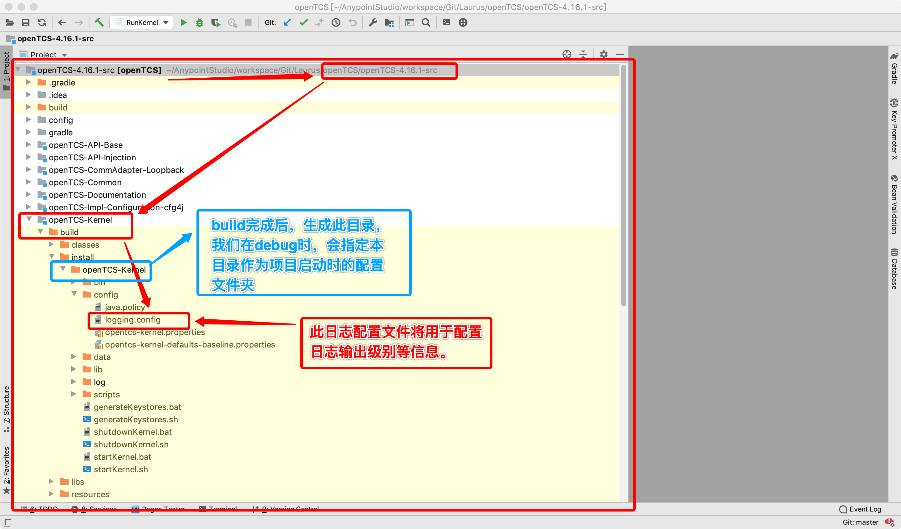
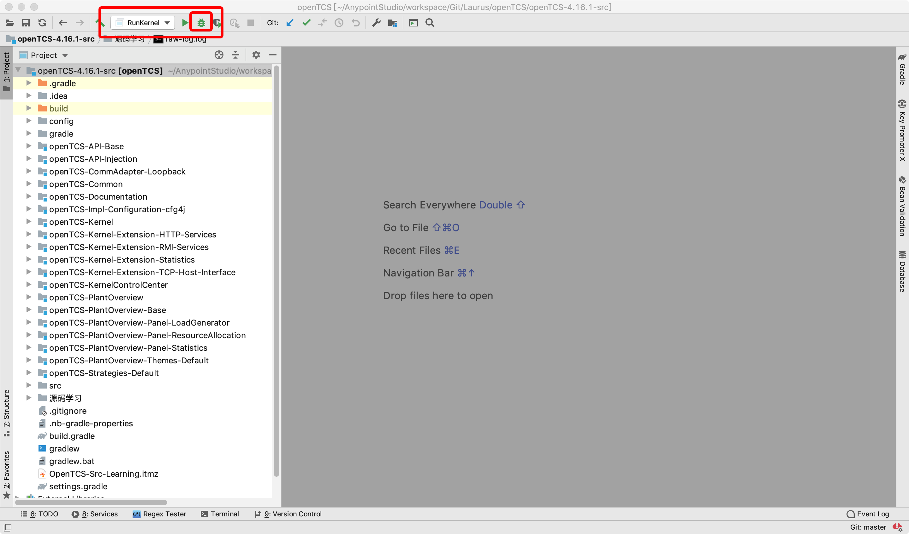

# openTCS 源码学习

本项目中，已在多个重要节点添加日志输出。原始代码请在历史提交记录中查看。


## 1. 环境准备

1. 将`openTCS/openTCS-4.16.1-src`导入IDEA

2. 配置`org.opentcs.kernel.RunKernel`启动方式

3. 详见[OpenTCS-IDEA-Debug](./openTCS-4.16.1-src/源码学习/OpenTCS-IDEA-Debug环境配置.md)

4. build源码

5. 调整log配置`openTCS-Kernel/build/install/openTCS-Kernel/config/logging.config`

   ```properties
   # 配置文件地址：openTCS-Kernel/build/install/openTCS-Kernel/config/logging.config
   # 1、指定全局所有class默认以INFO级别打印
   .level= INFO
   
   # 2、指定包、类的日志输出级别
   org.opentcs.util.CyclicTask.level = ALL
   org.opentcs.drivers.vehicle.BasicVehicleCommAdapter.level = ALL
   org.opentcs.kernel.KernelStateOperating.level = ALL
   org.opentcs.strategies.basic.level = ALL
   org.opentcs.kernel.services.level = ALL
   org.opentcs.virtualvehicle.level = ALL
   org.opentcs.kernel.vehicles.level = ALL
   org.opentcs.kernel.workingset.level = INFO
   org.opentcs.level = INFO
   java.level = WARNING
   org.eclipse = WARNING
   javax.level = WARNING
   sun.level = WARNING
   com.level = WARNING
   
   # 3、限制控制台最高输出级别(不管2中特定包的级别多高，都会在这里被过滤掉)
   handlers= java.util.logging.ConsoleHandler
   java.util.logging.ConsoleHandler.level = ALL
   java.util.logging.ConsoleHandler.formatter = org.opentcs.util.logging.SingleLineFormatter
   ```



## 2.启动openTCS-Kernel

以DEBUG方式启动内核项目




## 3.常规方式启动`KernelControllerCenter`及`PlantOverview`

```sh
# 
cd apps/openTCS-4.16.1-bin/openTCS-KernelControlCenter
./startKernelControlCenter.sh
```

```sh
cd apps/openTCS-4.16.1-bin/openTCS-PlantOverview 
./startPlantOverview.sh
```


## 4.开始debug。。。

